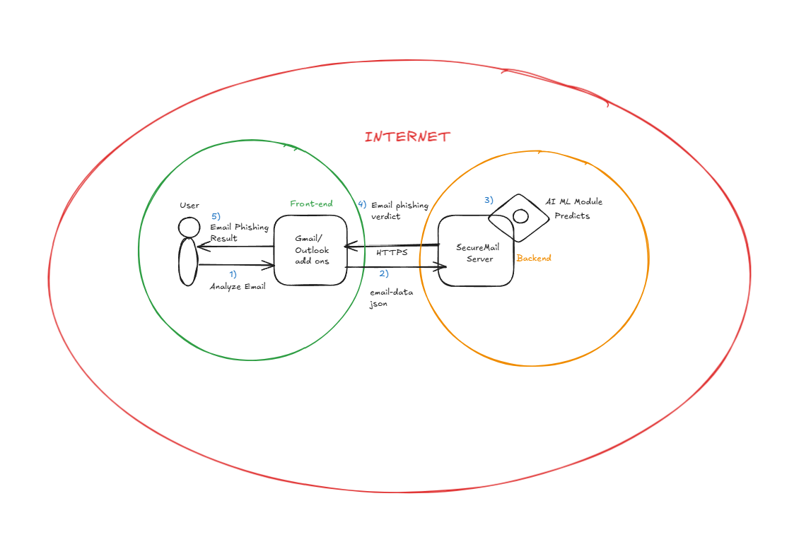

```
   _____                          __  __       _ _ 
  / ____|                        |  \/  |     (_) |
 | (___   ___  ___ _   _ _ __ ___| \  / | __ _ _| |
  \___ \ / _ \/ __| | | | '__/ _ \ |\/| |/ _` | | |
  ____) |  __/ (__| |_| | | |  __/ |  | | (_| | | |
 |_____/ \___|\___|\__,_|_|  \___|_|  |_|\__,_|_|_|
                                                   
```

---

## Tabla de Contenidos
- [Idiomas Disponibles](#available-languages)
- [Visión General del Proyecto](#project-overview)
- [Fase de Desarrollo](#development-phase)
- [Fase de CI/CD](#cicd-phase)
- [Fase de Producción](#production-phase)
- [Diseño y Arquitectura](#design-and-architecture)
- [Mejoras Futuras](#future-enhancements)
- [Licencia](#license)

---

## Idiomas Disponibles
- [Español](README.es.md)
- [Português](README.pt.md)

---

## Fase de Desarrollo

### Prácticas de Programación Segura:
- **Saneamiento de Datos**:
  - Las entradas externas (datos proporcionados por el usuario) se validan utilizando **Pydantic**.
  - Las entradas internas (respuestas de APIs de terceros) se revisan en busca de anomalías.
- **Gestión de Variables de Entorno**:
  - La información sensible (por ejemplo, claves API) se gestiona utilizando **Python-dotenv**.
- **Estrategias de Mitigación de Amenazas**:
  - Implementación de las pautas de codificación segura recomendadas por OWASP.

---

## Fase de CI/CD

### Herramientas de Seguridad y Pruebas:
- **Pylint**: Hace cumplir las mejores prácticas de calidad de código y seguridad.
- **Pytest**: Asegura la precisión de las respuestas API mediante pruebas rigurosas.
- **Snyk**: Realiza análisis estático de seguridad (SAST + SCA) para detectar vulnerabilidades.
- **Docker Bench Security**: Evalúa las configuraciones de seguridad del contenedor Docker.

---

## Fase de Producción

### Seguridad y Monitoreo:
- **Escaneo de Seguridad Continuo**:
  - **Snyk** para la detección de vulnerabilidades en dependencias en producción.
  - **Docker Bench Security** para la evaluación de seguridad de contenedores en tiempo de ejecución.
- **Plataforma de Despliegue**:
  - Alojado en **Render (PaaS)** utilizando despliegue basado en Docker para mayor fiabilidad.

> **[!IMPORTANTE]**  
> Asegúrate siempre de tener monitoreo continuo para detectar cualquier nueva vulnerabilidad a medida que surja en el entorno de producción.

---

## Diseño y Arquitectura

### Arquitectura de Flujo de Datos:
SecureMail sigue una **pipeline estructurada de procesamiento de datos** para analizar los correos electrónicos. A continuación, se muestra un resumen del flujo de datos:



### Firma de Código SLSA
> **[!ADVERTENCIA]**  
> Si no aseguras correctamente tu proceso de firma de código, corres el riesgo de introducir código malicioso en tu software.

- **Seguridad en la Cadena de Suministro de Software**:
  - Implementación de **SLSA (Supply Chain Levels for Software Artifacts)**.
  - Utiliza GnuPG para mejorar la seguridad de la firma de código.

---

## Mejoras Futuras

- **Gestión de la Postura de Seguridad de Aplicaciones (ASPM)**:
  - Integración de **Orquestación y Correlación de Seguridad de Aplicaciones (ASOC)**.
- **Modelado Avanzado de Amenazas**:
  - Utilización de **OWASP Threat Dragon** para un análisis estructurado de amenazas.

---

## Licencia
Distribuido bajo la licencia **GPL-3.0**. Consulta el archivo [LICENSE](./LICENSE) para más detalles.
