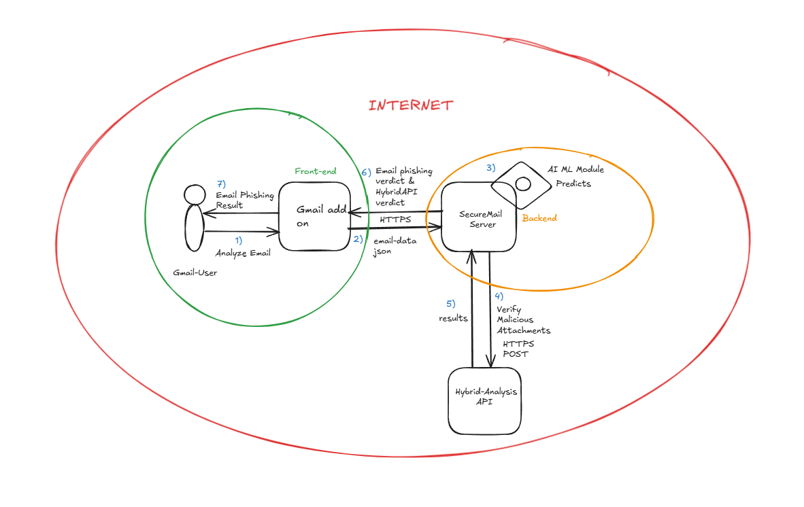

## Visão Geral do Projeto
O SecureMail integra modelos avançados de **ML**, incluindo **técnicas de PNL** e melhores práticas de segurança para detectar e-mails de phishing de forma eficiente. Ele segue um **ciclo de vida seguro de desenvolvimento de software (SDLC)**, implementando medidas de segurança em todas as fases: **desenvolvimento, CI/CD e produção**.

---

## Índice
- [Idiomas Disponíveis](#idiomas-disponíveis)
- [Visão Geral do Projeto](#visão-geral-do-projeto)
- [Fase de Desenvolvimento](#fase-de-desenvolvimento)
- [Fase de CI/CD](#fase-de-cicd)
- [Fase de Produção](#fase-de-produção)
- [Design e Arquitetura](#design-e-arquitetura)
- [Melhorias Futuras](#melhorias-futuras)
- [Licença](#licença)

---

## Idiomas Disponíveis
- [Español](README.es.md)
- [Português](README.pt.md)

---

## Fase de Desenvolvimento

### Práticas de Codificação Segura:
- **Sanitização de Dados**:
  - Entradas externas (dados fornecidos pelo usuário) são validadas usando **Pydantic**.
  - Entradas internas (respostas da API de terceiros) são revisadas para detectar anomalias.
- **Gerenciamento de Variáveis de Ambiente**:
  - Informações sensíveis (por exemplo, chaves de API) gerenciadas com **Python-dotenv**.
- **Estratégias de Mitigação de Ameaças**:
  - Implementação das diretrizes de codificação segura recomendadas pela OWASP.

---

## Fase de CI/CD

### Ferramentas de Segurança e Testes:
- **Pylint**: Aplica as melhores práticas de qualidade de código e segurança.
- **Pytest**: Garante a precisão das respostas da API por meio de testes rigorosos.
- **Snyk**: Realiza análise de segurança estática (SAST + SCA) para detectar vulnerabilidades.
- **Docker Bench Security**: Avalia as configurações de segurança dos containers Docker.
- **OWASP ZAP**: Realiza testes de segurança dinâmicos (DAST).

---

## Fase de Produção

### Segurança e Monitoramento:
- **Escaneamento Contínuo de Segurança**:
  - **Snyk** para detectar vulnerabilidades de dependências em produção.
  - **Docker Bench Security** para avaliações de segurança em tempo de execução dos containers.
  - **OWASP ZAP** para testes dinâmicos.
- **Plataforma de Desdobramento**:
  - Hospedado em **Render (PaaS)** utilizando desdobramento baseado em Docker para maior confiabilidade.

> [!IMPORTANTE]  
> Sempre certifique-se de monitorar continuamente para identificar quaisquer novas vulnerabilidades à medida que surgem no ambiente de produção.

---

## Design e Arquitetura

### Arquitetura de Fluxo de Dados:
O SecureMail segue um **pipeline estruturado de processamento de dados** para analisar os e-mails. Abaixo está uma visão geral do fluxo de dados:

- **Assinatura de Código com Chave GPG**:
  - Utiliza GnuPG para aumentar a segurança da assinatura de código dentro dos commits do Github.

> [!AVISO]  
> Se você não proteger adequadamente o seu processo de assinatura de código, corre o risco de introduzir código malicioso no seu software, como no caso do SolarWinds.

---

## Melhorias Futuras

- **Integração da Orquestração e Correlação de Segurança de Aplicações (ASOC)**.
- **Modelagem Avançada de Ameaças**:
  - Usando **OWASP Threat Dragon** para análise estruturada de ameaças.

---

## Licença
Distribuído sob a licença **GPL-3.0**. Consulte o arquivo [LICENSE](./LICENSE) para mais detalhes.
